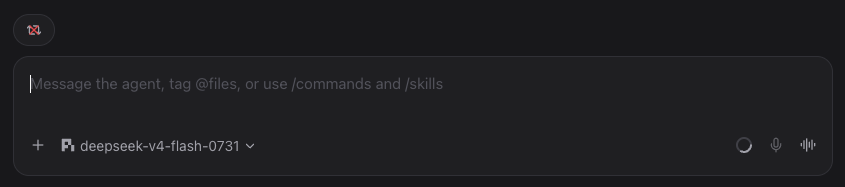

<h1 align="center">Paseo · You're Looping</h1>

<p align="center">
  A tiny <a href="https://paseo.sh">Paseo</a> plugin that stops a stuck agent and nudges it back on track.
</p>

<p align="center">
  <a href="#install"><strong>Install</strong></a> ·
  <a href="#how-it-works"><strong>How it works</strong></a> ·
  <a href="#development"><strong>Development</strong></a> ·
  <a href="#license"><strong>License</strong></a>
</p>

---

## Why

Every now and then an agent gets stuck in a loop — repeating the same step, re-reading the same file, going in circles. You can see it happening, and you know exactly what it needs to hear.

**You're looping.**

This plugin puts that nudge one click away. It adds a small pill to the composer that stops the current run and sends the message for you, so you can get back to work instead of typing it out.

## Install

Paseo 0.8 and later (the repository root):

```bash
paseo plugin add 721p/paseo-youre-looping
```

Paseo 0.7 (the [`v0.7/`](./v0.7) subdirectory):

```bash
paseo plugin add 721p/paseo-youre-looping:v0.7
```

Paseo 0.7 and 0.8 use incompatible plugin manifests and entry points, so this repository ships
a build for each: the root is the 0.8 plugin, and `v0.7/` is the 0.7 plugin. Install the one that
matches your daemon.

Then make sure plugins are enabled in **Paseo → Settings → Plugins**.

If your Paseo daemon is password-protected:

```bash
PASEO_PASSWORD="your-password" paseo plugin add 721p/paseo-youre-looping
```

### Update

```bash
paseo plugin update paseo-youre-looping
```

For a password-protected daemon:

```bash
PASEO_PASSWORD="your-password" paseo plugin update paseo-youre-looping
```

## How it works

The plugin adds a composer pill with a repeat icon and a red **X** overlay — *stop the current loop, start a fresh turn*.

<p align="center">
  
</p>

When you click it:

1. If the agent has an active turn, the plugin stops the execution.
2. It sends a new user message:

   > You're looping

That's the whole thing. No config, no settings, no ceremony.

## Development

Clone the repo and install dependencies:

```bash
git clone https://github.com/721p/paseo-youre-looping.git
cd paseo-youre-looping
npm install
```

Type-check the Paseo 0.8 plugin (repository root):

```bash
npm run typecheck
```

Type-check the Paseo 0.7 plugin (needs its own SDK version):

```bash
cd v0.7
npm install
npm run typecheck
```

Install the local development copy for Paseo 0.8:

```bash
paseo plugin install "$(pwd)"
```

For Paseo 0.7, install the `v0.7/` subdirectory instead:

```bash
paseo plugin install "$(pwd)/v0.7"
```

After making changes:

```bash
npm run typecheck
paseo plugin reload paseo-youre-looping
```

## Security

Paseo plugins are trusted code. Plugin server code runs on the daemon host, so only install plugins you trust.

Do not commit:

- Paseo passwords
- API keys
- Tokens
- `.env` files containing secrets

## License

[MIT](./LICENSE)
